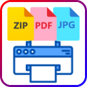

# 📋 Attach Print All for Thunderbird

Thunderbirdで受信したメール内のすべての添付ファイル（PDF・画像・ZIP内コンテンツ）を、ワンクリックで1つのPDFファイルに結合して保存・閲覧できる実務特化型アドオンです。

複数のPDFや画像を1つずつダウンロードして印刷する手間を排除し、業務効率を大幅に向上させます。

---

## ✨ 主な機能

* **ワンクリック一括結合**: メール内のすべての添付ファイルを自動で解析し、1枚の統合PDFにまとめます。
* **スマートZIP自動解凍**: 添付された `.zip` ファイルの中身を自動展開し、含まれる画像やPDFを取り出して結合対象に含めます。
* **保護付きPDF対応**: 印刷制限やセキュリティ保護が設定されたPDFファイルも停止することなく自動で処理します。
* **重複を防ぐスマート命名**: `MA_送信日時_送信者名.pdf` の形式で自動保存されるため、ファイルの上書き防止や管理が容易です。
* **完全ローカル処理**: 取得したファイルやメールデータは一切外部のサーバーに送信されないため、社外秘データでも安心です。

---

## 📁 対応ファイルフォーマット

メールに含まれる添付ファイルから以下の拡張子を判別し、安全に抽出・結合します。

| 形式 | 拡張子 | 処理内容 |
| :--- | :--- | :--- |
| **PDF** | `.pdf` | ページ順を維持してそのまま統合（暗号化保護ファイル対応） |
| **画像** | `.png`, `.jpg`, `.jpeg` | 画像のサイズに合わせてPDFの各ページに自動埋め込み |
| **圧縮アーカイブ** | `.zip` | 内部を解凍し、中のPDFおよび画像を再帰的に抽出・結合 |
| **その他** | `.docx`, `.xlsx`, `.txt` 等 | 結合エラーを防ぐため自動的に安全にスキップ |

---

## 🚀 使い方

1. Thunderbirdで添付ファイルのあるメールを選択します。
2. ツールバーの **全添付印刷** ボタンをクリックします（または添付ファイルの右クリックメニューから「すべての添付ファイルを結合して印刷」を選択）。
3. 解析が完了すると「保存完了画面」タブが開きます。
4. **「PDFを開く」** ボタンをクリックすると、お使いのPCで規定されている標準アプリ（Chrome、Edge、Adobe Acrobatなど）で即座にPDFが起動します。

---

## ⚙️ インストール方法

### 公式ストアからインストール（推奨）
現在Thunderbird Add-onsストアにて審査中です。
https://addons.thunderbird.net/ja/thunderbird/addon/attach-print-all/

### 手動インストール（開発者向け / 身内配布用）
1. 本リポジトリのソースコード、またはリリースから `.xpi`（または `.zip`）ファイルをダウンロードします。
2. Thunderbirdの「アドオンとテーマ」画面を開きます。
3. 歯車アイコンから「ファイルからアドオンをインストール」を選択し、読み込ませてください。

---

## 📜 ライセンス

MIT License - 商用利用、改変、再配布など、誰でも不自由なく自由にお使いいただけます。
